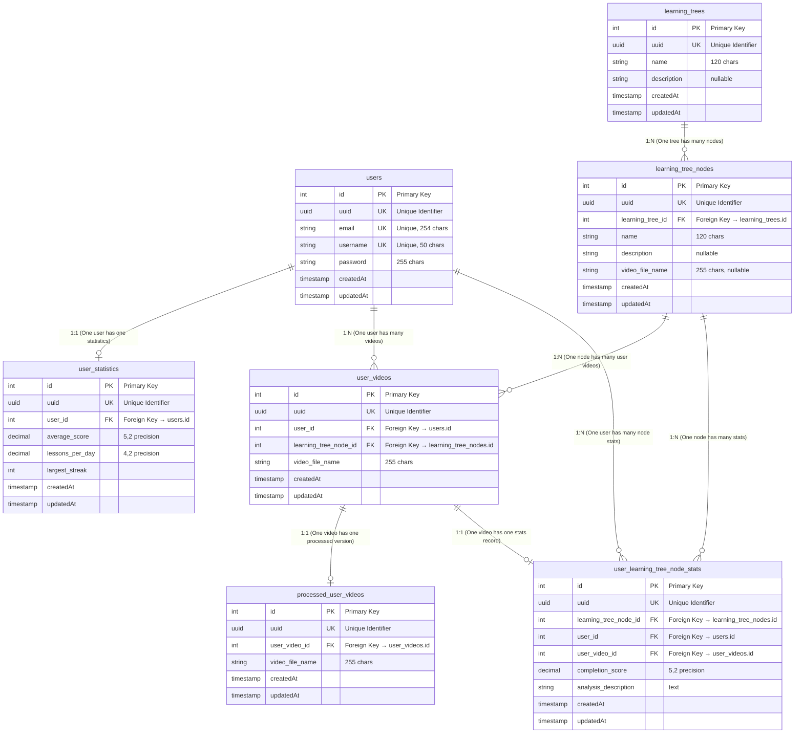

# Entity Relationship Diagram (ERD)

This document provides a visual representation of the database schema and relationships between entities in the application.

## Database Schema Overview



## Relationship Map

```
┌─────────────────────┐
│      users          │
│  ────────────────   │
│  id (PK)            │
│  uuid (UK)          │◄─────┐
│  email (UK)         │      │
│  username (UK)      │      │
│  password           │      │
│  createdAt          │      │
│  updatedAt          │      │
└─────────────────────┘      │
         │                   │
         │ 1:1               │ 1:N
         │                   │
         ▼                   │
┌─────────────────────┐      │
│  user_statistics    │      │
│  ────────────────   │      │
│  id (PK)            │      │
│  uuid (UK)          │      │
│  user_id (FK) ──────┘      │
│  average_score      │      │
│  lessons_per_day    │      │
│  largest_streak     │      │
│  createdAt          │      │
│  updatedAt          │      │
└─────────────────────┘      │
                             │
┌─────────────────────┐      │
│   learning_trees    │      │
│  ────────────────   │      │
│  id (PK)            │      │
│  uuid (UK)          │      │
│  name               │      │
│  description        │      │
│  createdAt          │      │
│  updatedAt          │      │
└─────────────────────┘      │
         │                   │
         │ 1:N               │
         │                   │
         ▼                   │
┌─────────────────────┐      │
│ learning_tree_nodes │      │
│  ────────────────   │      │
│  id (PK)            │      │
│  uuid (UK)          │      │
│  learning_tree_id ──┘      │
│  name               │      │
│  description        │      │
│  video_file_name    │      │
│  createdAt          │      │
│  updatedAt          │      │
└─────────────────────┘      │
         │                   │
         │ 1:N               │
         │                   │
         ▼                   │
┌─────────────────────┐      │
│    user_videos      │◄─────┘
│  ────────────────   │
│  id (PK)            │
│  uuid (UK)          │
│  user_id (FK) ──────┐
│  learning_tree_node │
│    _id (FK)         │
│  video_file_name    │
│  createdAt          │
│  updatedAt          │
└─────────────────────┘
         │
         │ 1:1        │ 1:1
         │            │
         ▼            ▼
┌─────────────────┐ ┌──────────────────────────┐
│processed_user_  │ │user_learning_tree_node_  │
│    videos       │ │        stats             │
│  ────────────   │ │  ────────────────────    │
│  id (PK)        │ │  id (PK)                 │
│  uuid (UK)      │ │  uuid (UK)               │
│  user_video_id ─┘ │  learning_tree_node_id   │
│  video_file_name│ │  user_id (FK)  ──────────┐
│  createdAt      │ │  user_video_id (FK)  ────┘
│  updatedAt      │ │  completion_score        │
└─────────────────┘ │  analysis_description    │
                    │  createdAt               │
                    │  updatedAt               │
                    └──────────────────────────┘
```

## Entity Descriptions

### User
- **Purpose**: Stores user account information
- **Key Fields**: `email` (unique), `username` (unique), `password`
- **Relationships**:
  - One-to-One with `UserStatistics`
  - One-to-Many with `UserVideo`
  - One-to-Many with `UserLearningTreeNodeStats`

### UserStatistics
- **Purpose**: Stores aggregated statistics for a user
- **Key Fields**: `average_score`, `lessons_per_day`, `largest_streak`
- **Relationships**:
  - Many-to-One with `User` (One-to-One from User perspective)

### LearningTree
- **Purpose**: Represents a learning path or curriculum
- **Key Fields**: `name`, `description`
- **Relationships**:
  - One-to-Many with `LearningTreeNode`

### LearningTreeNode
- **Purpose**: Represents a single lesson or node within a learning tree
- **Key Fields**: `name`, `description`, `video_file_name`
- **Relationships**:
  - Many-to-One with `LearningTree`
  - One-to-Many with `UserVideo`
  - One-to-Many with `UserLearningTreeNodeStats`

### UserVideo
- **Purpose**: Stores user-uploaded videos associated with learning tree nodes
- **Key Fields**: `video_file_name`, `user_id`, `learning_tree_node_id`
- **Relationships**:
  - Many-to-One with `User`
  - Many-to-One with `LearningTreeNode`
  - One-to-One with `ProcessedUserVideo`
  - One-to-One with `UserLearningTreeNodeStats`

### ProcessedUserVideo
- **Purpose**: Stores processed/analyzed versions of user videos
- **Key Fields**: `video_file_name`, `user_video_id`
- **Relationships**:
  - Many-to-One with `UserVideo` (One-to-One from UserVideo perspective)

### UserLearningTreeNodeStats
- **Purpose**: Stores performance statistics for a user's video submission on a specific learning tree node
- **Key Fields**: `completion_score`, `analysis_description`
- **Relationships**:
  - Many-to-One with `User`
  - Many-to-One with `LearningTreeNode`
  - Many-to-One with `UserVideo` (One-to-One from UserVideo perspective)

## Relationship Details

### Relationship Summary Table

| From Table | To Table | Type | Foreign Key | Description |
|------------|----------|------|-------------|-------------|
| `user_statistics` | `users` | Many-to-One (1:1) | `user_id` → `users.id` | Each user has one statistics record |
| `user_videos` | `users` | Many-to-One (1:N) | `user_id` → `users.id` | A user can upload many videos |
| `user_learning_tree_node_stats` | `users` | Many-to-One (1:N) | `user_id` → `users.id` | A user can have many node statistics |
| `learning_tree_nodes` | `learning_trees` | Many-to-One (1:N) | `learning_tree_id` → `learning_trees.id` | A learning tree contains many nodes |
| `user_videos` | `learning_tree_nodes` | Many-to-One (1:N) | `learning_tree_node_id` → `learning_tree_nodes.id` | A node can have many user videos |
| `user_learning_tree_node_stats` | `learning_tree_nodes` | Many-to-One (1:N) | `learning_tree_node_id` → `learning_tree_nodes.id` | A node can have many statistics |
| `processed_user_videos` | `user_videos` | Many-to-One (1:1) | `user_video_id` → `user_videos.id` | Each user video has one processed version |
| `user_learning_tree_node_stats` | `user_videos` | Many-to-One (1:1) | `user_video_id` → `user_videos.id` | Each user video has one statistics record |

### One-to-One Relationships
1. **users ↔ user_statistics**: Each user has exactly one statistics record
2. **user_videos ↔ processed_user_videos**: Each user video can have one processed version
3. **user_videos ↔ user_learning_tree_node_stats**: Each user video has one statistics record

### One-to-Many Relationships
1. **users → user_videos**: A user can upload multiple videos
2. **users → user_learning_tree_node_stats**: A user can have multiple node statistics
3. **learning_trees → learning_tree_nodes**: A learning tree contains multiple nodes
4. **learning_tree_nodes → user_videos**: A node can have multiple user videos
5. **learning_tree_nodes → user_learning_tree_node_stats**: A node can have multiple user statistics

## Indexes

The following fields are indexed for performance:
- All `uuid` fields (for fast lookups)
- All foreign key fields (`user_id`, `learning_tree_id`, `learning_tree_node_id`, `user_video_id`)
- `User.email` and `User.username` (for authentication lookups)

## Notes

- All entities include `createdAt` and `updatedAt` timestamps for audit purposes
- All entities use UUIDs as external identifiers (in addition to integer primary keys)
- Foreign key relationships are enforced at the database level
- The schema supports cascading operations where appropriate
